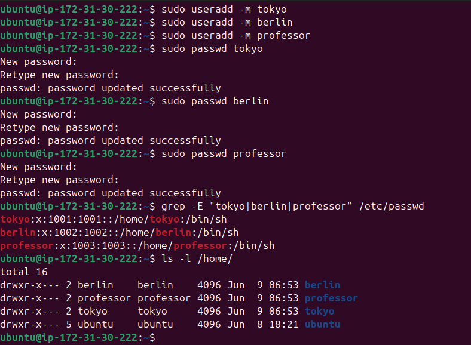
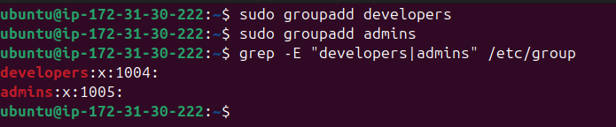
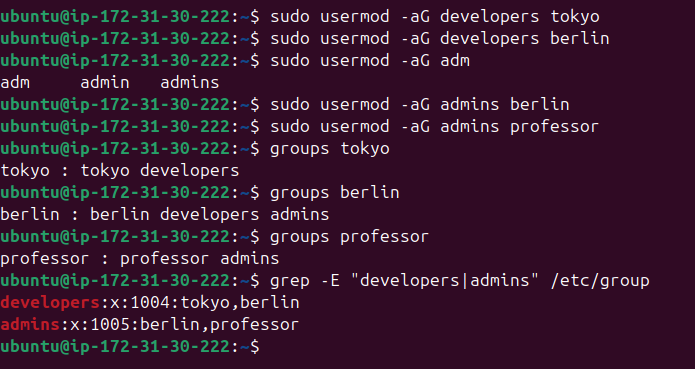
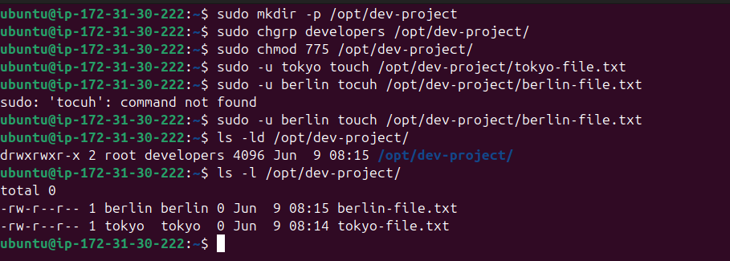
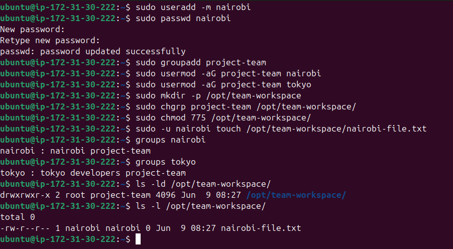

## Users & Groups Created

- **Users:** `tokyo`, `berlin`, `professor`, `nairobi`
- **Groups:** `developers`, `admins`, `project-team`

---

## Task 1: Create Users

### What We Did
Created three users - `tokyo`, `berlin`, and `professor` - each with their own home directory and a password.

### Commands Used

```bash
# Create users with home directories (-m flag creates /home/<username>)
sudo useradd -m tokyo
sudo useradd -m berlin
sudo useradd -m professor

# Set passwords for each user
sudo passwd tokyo
sudo passwd berlin
sudo passwd professor
```

### Verification

```bash
# Check /etc/passwd to confirm users were created
grep -E "tokyo|berlin|professor" /etc/passwd

# Check that home directories exist
ls -l /home/
```

### Expected Output



### Explanation
- `/etc/passwd` stores basic account info: username, UID, GID, home dir, and shell.
- The `-m` flag in `useradd` automatically creates the home directory (e.g., `/home/tokyo`).
- `passwd` sets or changes the login password for a user.

---

## Task 2: Create Groups

### What We Did
Created two groups - `developers` and `admins` - that will be used to control access to shared directories.

### Commands Used

```bash
# Create groups
sudo groupadd developers
sudo groupadd admins
```

### Verification

```bash
# Check /etc/group to confirm groups exist
grep -E "developers|admins" /etc/group
```

### Expected Output



### Explanation
- Groups in Linux allow multiple users to share the same permissions on files and directories.
- `/etc/group` stores group definitions: group name, password (usually `x`), GID, and member list.
- `groupadd` creates a new group entry in `/etc/group`.

---
## Task 3: Assign Users to Groups

### What We Did
Assigned each user to the appropriate groups based on their role:

| User      | Groups                    |
|-----------|---------------------------|
| tokyo     | developers                |
| berlin    | developers + admins       |
| professor | admins                    |

### Commands Used

```bash
# Add tokyo to developers
sudo usermod -aG developers tokyo

# Add berlin to both developers and admins
sudo usermod -aG developers berlin
sudo usermod -aG admins berlin

# Add professor to admins
sudo usermod -aG admins professor
```

### Verification

```bash
# Check group memberships for each user
groups tokyo
groups berlin
groups professor

# OR check /etc/group directly
grep -E "developers|admins" /etc/group
```

### Expected Output



### Explanation
- `usermod -aG` modifies an existing user's group memberships.
- The `-a` flag means **append** - it adds to existing groups without removing any.
- The `-G` flag specifies the supplementary group(s) to add.
- **Without `-a`, using just `-G` would REPLACE all existing supplementary groups** - a common mistake!

---
## Task 4: Shared Directory for Developers

### What We Did
Created a shared directory `/opt/dev-project` owned by the `developers` group, with permissions allowing group members to read, write, and execute.

### Commands Used

```bash
# Step 1: Create the directory
sudo mkdir -p /opt/dev-project

# Step 2: Set group ownership to developers
sudo chgrp developers /opt/dev-project

# Step 3: Set permissions to 775 (rwxrwxr-x)
sudo chmod 775 /opt/dev-project

# Step 4: Test by creating files as tokyo and berlin
sudo -u tokyo touch /opt/dev-project/tokyo-file.txt
sudo -u berlin touch /opt/dev-project/berlin-file.txt
```

### Verification

```bash
# Check directory permissions and ownership
ls -ld /opt/dev-project

# List files inside to confirm both users could write
ls -l /opt/dev-project/
```

### Expected Output



### Explanation
- `chmod 775` breaks down as:
  - `7` (owner) = rwx - read, write, execute
  - `7` (group) = rwx - read, write, execute
  - `5` (others) = r-x - read and execute only
- `chgrp developers /opt/dev-project` changes the group owner to `developers`.
- `sudo -u username command` runs a command **as** that user, which is useful for testing access without switching accounts.
- Only members of `developers` (tokyo and berlin) can write to this directory. `professor` cannot.

---
## Task 5: Team Workspace

### What We Did
Created a new user `nairobi`, a new group `project-team`, added both `nairobi` and `tokyo` to it, then set up a shared workspace directory for the team.

### Commands Used

```bash
# Step 1: Create nairobi with home directory
sudo useradd -m nairobi
sudo passwd nairobi

# Step 2: Create project-team group
sudo groupadd project-team

# Step 3: Add nairobi and tokyo to project-team
sudo usermod -aG project-team nairobi
sudo usermod -aG project-team tokyo

# Step 4: Create the workspace directory
sudo mkdir -p /opt/team-workspace

# Step 5: Set group ownership and permissions
sudo chgrp project-team /opt/team-workspace
sudo chmod 775 /opt/team-workspace

# Step 6: Test by creating a file as nairobi
sudo -u nairobi touch /opt/team-workspace/nairobi-file.txt
```

### Verification

```bash
# Check nairobi's group memberships
groups nairobi

# Check directory ownership and permissions
ls -ld /opt/team-workspace

# Verify file was created successfully
ls -l /opt/team-workspace/
```

### Expected Output



```

### Explanation
- The `project-team` group acts as a collaboration layer - any user added to it automatically gets write access to the shared workspace.
- This pattern is common in DevOps: instead of managing individual file permissions, you manage group memberships, and the directory permissions stay fixed.
- `755` would allow group members to only read/execute; `775` allows them to also **write and create files** inside the directory.

---

## Group Assignments Summary

| User      | Primary Group | Supplementary Groups       |
|-----------|---------------|----------------------------|
| tokyo     | tokyo         | developers, project-team   |
| berlin    | berlin        | developers, admins         |
| professor | professor     | admins                     |
| nairobi   | nairobi       | project-team               |

---

## Directories Created

| Directory           | Owner | Group        | Permissions | Notes                        |
|---------------------|-------|--------------|-------------|------------------------------|
| `/opt/dev-project`  | root  | developers   | 775         | Shared for developers group  |
| `/opt/team-workspace` | root | project-team | 775       | Shared for project-team      |

---

## All Commands Used

```bash
# --- User Creation ---
sudo useradd -m tokyo
sudo useradd -m berlin
sudo useradd -m professor
sudo useradd -m nairobi

# --- Set Passwords ---
sudo passwd tokyo
sudo passwd berlin
sudo passwd professor
sudo passwd nairobi

# --- Group Creation ---
sudo groupadd developers
sudo groupadd admins
sudo groupadd project-team

# --- Group Assignments ---
sudo usermod -aG developers tokyo
sudo usermod -aG developers berlin
sudo usermod -aG admins berlin
sudo usermod -aG admins professor
sudo usermod -aG project-team nairobi
sudo usermod -aG project-team tokyo

# --- Directory Setup ---
sudo mkdir -p /opt/dev-project
sudo chgrp developers /opt/dev-project
sudo chmod 775 /opt/dev-project

sudo mkdir -p /opt/team-workspace
sudo chgrp project-team /opt/team-workspace
sudo chmod 775 /opt/team-workspace

# --- Testing Access ---
sudo -u tokyo touch /opt/dev-project/tokyo-file.txt
sudo -u berlin touch /opt/dev-project/berlin-file.txt
sudo -u nairobi touch /opt/team-workspace/nairobi-file.txt

# --- Verification Commands ---
grep -E "tokyo|berlin|professor|nairobi" /etc/passwd
ls -l /home/
grep -E "developers|admins|project-team" /etc/group
groups tokyo
groups berlin
groups professor
groups nairobi
ls -ld /opt/dev-project
ls -ld /opt/team-workspace
ls -l /opt/dev-project/
ls -l /opt/team-workspace/

# --- Switching Users ---
su - tokyo
exit          # go back to previous user

# --- Removing a User from a Group ---
sudo gpasswd -d tokyo developers

# --- Delete a user entirely ---
sudo userdel -r tokyo        # -r also deletes their home folder

# --- Delete a group entirely ---
sudo groupdel developers

```

---

## What I Learned

1. **`-aG` is critical when adding users to groups** - the `-a` (append) flag ensures existing group memberships are preserved. Without it, `usermod -G` would remove the user from all other supplementary groups and only keep the one specified. This is an easy mistake that can silently break access controls.

2. **Permissions are a combination of ownership + mode** - `chmod 775` alone isn't enough; you also need `chgrp` to set the correct group owner. A directory set to `775` only grants write access to the group specified in the ownership, not every group on the system.

3. **Group-based access control scales well in real DevOps environments** - instead of editing file permissions every time a teammate joins or leaves a project, you simply add or remove them from a group. The shared directories stay unchanged. This is the foundation of how tools like sudo rules, CI/CD system access, and cloud IAM roles work.

4. **tokyo : tokyo developers** - 
* The first tokyo is the username you passed to the groups command.
* The second tokyo is the primary group - in Linux, when you create a user with useradd, it automatically creates a group with the same name as the user. That's tokyo's personal default group.
* Then developers is the **supplementary group** I manually added.
* So the format is always:
   <username> : <primary-group> <supplementary-groups...>

--------
