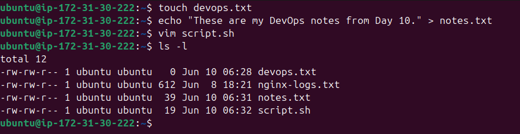
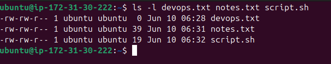
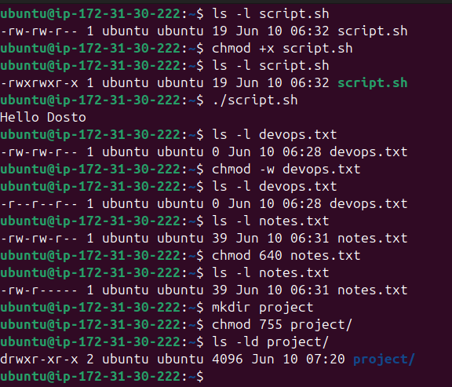
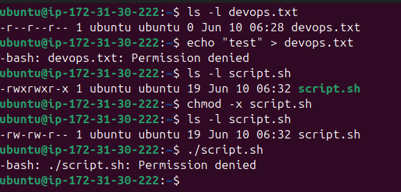

## � Overview

On Day 10, I dived deep into **Linux file operations and permissions** - one of the most critical concepts in DevOps and system administration. Understanding who can read, write, or execute a file is fundamental for security, collaboration, and system integrity.

---

## � What I Practiced

- Creating files using `touch`, `echo`, `cat`, and `vim`
- Reading files using `cat`, `head`, `tail`, and `vim`
- Understanding Linux permission structure (`rwxrwxrwx`)
- Modifying permissions with `chmod`
- Testing permission enforcement in real scenarios

---

## � Key Concepts

### � What Are File Permissions?

Linux file permissions control **who can do what** with a file or directory. Every file has three permission groups:

| Group   | Represents        |
|---------|-------------------|
| Owner   | The user who created the file |
| Group   | A set of users sharing access |
| Others  | Everyone else on the system   |

### � Permission Format: `rwxrwxrwx`

```
- r w x | r w x | r w x
  Owner   Group   Others
```

| Symbol | Meaning  | Numeric Value |
|--------|----------|---------------|
| `r`    | Read     | 4             |
| `w`    | Write    | 2             |
| `x`    | Execute  | 1             |
| `-`    | No perm  | 0             |

**Example:**
```
-rw-r--r--
 ↑  ↑  ↑
 │  │  └── Others: read only (4)
 │  └───── Group: read only (4)
 └──────── Owner: read + write (6)
```

---

## ✅ Task 1: Create Files

### Commands Used

```bash
# Create an empty file
touch devops.txt

# Create a file with content using echo
echo "These are my DevOps notes from Day 10." > notes.txt

# Create a shell script using vim
vim script.sh
# Inside vim:
# Press 'i' to enter insert mode
# Type: echo "Hello DevOps"
# Press Esc
# Type :wq and press Enter to save and exit

# Verify all files were created
ls -l
```

### � Output



### � Command Explanations

| Command | What it does |
|---------|-------------|
| `touch devops.txt` | Creates an empty file. If the file already exists, it updates its timestamp. |
| `echo "text" > file` | Writes text into a file. `>` overwrites; `>>` appends. |
| `vim script.sh` | Opens the vim text editor to create/edit a file. |
| `ls -l` | Lists files in long format showing permissions, owner, size, and date. |


----

## ✅ Task 2: Read Files

### Commands Used

```bash
# Read the content of notes.txt
cat notes.txt

# View script.sh in read-only mode (no accidental edits)
vim -R script.sh

# Display first 5 lines of /etc/passwd
head -n 5 /etc/passwd

# Display last 5 lines of /etc/passwd
tail -n 5 /etc/passwd
```

### � Output


### � Command Explanations

| Command | What it does |
|---------|-------------|
| `cat notes.txt` | Displays the full content of a file. |
| `vim -R script.sh` | Opens a file in read-only mode. Prevents accidental modification. |
| `head -n 5 /etc/passwd` | Shows the first 5 lines of a file. Great for peeking at large files. |
| `tail -n 5 /etc/passwd` | Shows the last 5 lines. Useful for checking recent log entries. |

> � `/etc/passwd` stores user account info: username, UID, GID, home dir, and default shell.

---

## ✅ Task 3: Understand Permissions

### Checking Current Permissions

```bash
ls -l devops.txt notes.txt script.sh
```

### � Output



### � Permission Breakdown

| File         | Permission   | Owner        | Group        | Others |
| ------------ | ------------ | ------------ | ------------ | ------ |
| `devops.txt` | `-rw-rw-r--` | read + write | read + write | read   |
| `notes.txt`  | `-rw-rw-r--` | read + write | read + write | read   |
| `script.sh`  | `-rw-rw-r--` | read + write | read + write | read   |

**Answer:** By default, the owner can read and write. Group and others can only read. Nobody can execute yet - we fix that in Task 4!

---

## ✅ Task 4: Modify Permissions

### Commands Used

```bash
# 1. Make script.sh executable for all
chmod +x script.sh
ls -l script.sh

# Run the script
./script.sh

# 2. Make devops.txt read-only for everyone (remove write for all)
chmod a-w devops.txt
ls -l devops.txt

# 3. Set notes.txt to 640 (owner: rw, group: r, others: none)
chmod 640 notes.txt
ls -l notes.txt

# 4. Create a directory with 755 permissions
mkdir project
chmod 755 project
ls -ld project
```

### � Output



### � chmod Explained

**Symbolic mode:**
```bash
chmod +x file      # Add execute for all
chmod -w file      # Remove write for all
chmod a-w file     # Remove write for all (a = all: owner, group, others)
chmod u+x file     # Add execute for owner only
```

**Numeric (Octal) mode:**
```
chmod 640 notes.txt
  6 = rw-  (owner: 4+2 = read+write)
  4 = r--  (group: 4 = read only)
  0 = ---  (others: no permissions)
```

**Common Permission Values:**

| Octal | Permission | Use Case |
|-------|-----------|----------|
| `777` | `rwxrwxrwx` | Full access for all (avoid in production!) |
| `755` | `rwxr-xr-x` | Scripts, directories |
| `644` | `rw-r--r--` | Regular files (default) |
| `640` | `rw-r-----` | Private config files |
| `600` | `rw-------` | SSH keys, secrets |
| `444` | `r--r--r--` | Read-only for all |

---

### � Binary → Octal → Permission (Quick Memory Table)
 
Each permission digit (0–7) is just **3 bits** representing r, w, x:
 
| Octal | Binary | r | w | x | Permission |
|-------|--------|---|---|---|------------|
| `0`   | `000`  | ✗ | ✗ | ✗ | `---` — no permissions |
| `1`   | `001`  | ✗ | ✗ | ✓ | `--x` — execute only |
| `2`   | `010`  | ✗ | ✓ | ✗ | `-w-` — write only |
| `3`   | `011`  | ✗ | ✓ | ✓ | `-wx` — write + execute |
| `4`   | `100`  | ✓ | ✗ | ✗ | `r--` — read only |
| `5`   | `101`  | ✓ | ✗ | ✓ | `r-x` — read + execute |
| `6`   | `110`  | ✓ | ✓ | ✗ | `rw-` — read + write |
| `7`   | `111`  | ✓ | ✓ | ✓ | `rwx` — full access |
 
> � **How to read it:** Think of each bit as a switch — `1` = ON, `0` = OFF.  
> Position 1 = read (4), Position 2 = write (2), Position 3 = execute (1).  
> Add up the ON bits to get the octal digit: `110` = 4+2+0 = **6** = `rw-`
 
**So `chmod 755` means:**
```
7 = 111 = rwx  → owner gets everything
5 = 101 = r-x  → group gets read + execute
5 = 101 = r-x  → others get read + execute
```
 
---

## ✅ Task 5: Test Permissions

### Commands Used

```bash
# Test 1: Try writing to a read-only file
echo "test" > devops.txt

# Test 2: Remove execute permission and try running the script
chmod -x script.sh
./script.sh
```

### � Output & Error Messages



### � What Happened?

| Test | Action | Result | Why |
|------|--------|--------|-----|
| Write to read-only | `echo > devops.txt` | `Permission denied` | `chmod a-w` removed write for everyone including owner |
| Execute without `+x` | `./script.sh` | `Permission denied` | Shell requires execute bit set to run a file directly |

> � **Pro Tip:** Even as the file owner, you cannot override permission restrictions unless you use `sudo` or change the permissions first.

---

## � Permission Summary Table

| File/Dir | Before | After | Who Can Do What |
|----------|--------|-------|-----------------|
| `devops.txt` | `-rw-r--r--` | `-r--r--r--` | All: read only |
| `notes.txt` | `-rw-r--r--` | `-rw-r-----` | Owner: rw, Group: r, Others: none |
| `script.sh` | `-rw-r--r--` | `-rwxr-xr-x` | Owner: rwx, Group/Others: rx |
| `project/` | *(new)* | `drwxr-xr-x` | Owner: full, Group/Others: read+enter |

---

## � All Commands Used

```bash
# --- Task 1: Create Files ---
touch devops.txt
echo "These are my DevOps notes from Day 10." > notes.txt
vim script.sh          # Add: echo "Hello Dosto", then :wq
ls -l

# --- Task 2: Read Files ---
cat notes.txt
vim -R script.sh
head -n 5 /etc/passwd
tail -n 5 /etc/passwd

# --- Task 3: Understand Permissions ---
ls -l devops.txt notes.txt script.sh

# --- Task 4: Modify Permissions ---
chmod +x script.sh
ls -l script.sh
./script.sh

chmod a-w devops.txt
ls -l devops.txt

chmod 640 notes.txt
ls -l notes.txt

mkdir project
chmod 755 project
ls -ld project

# --- Task 5: Test Permissions ---
echo "test" > devops.txt     # Should fail: Permission denied
chmod -x script.sh
./script.sh                  # Should fail: Permission denied
```

---

## � What I Learned

1. **Permissions are the foundation of Linux security** – Every file has an owner, group, and others with distinct read/write/execute rights. Misconfigurations can expose sensitive data or allow unauthorized code execution.

2. **`chmod` gives you precise control** – Whether using symbolic (`+x`, `a-w`) or numeric (`755`, `640`) mode, you can set exactly who can do what. Understanding octal notation is a must-have DevOps skill.

3. **Permission denied errors are features, not bugs** – Linux actively enforces these restrictions even for the file owner. Testing permissions before deploying scripts or configurations prevents real-world security incidents.

---

## � References

- [Linux File Permissions Explained](https://linuxize.com/post/understanding-linux-file-permissions/)
