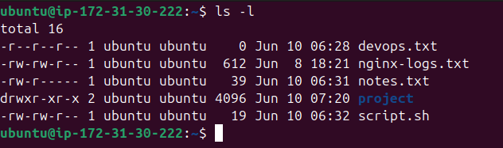
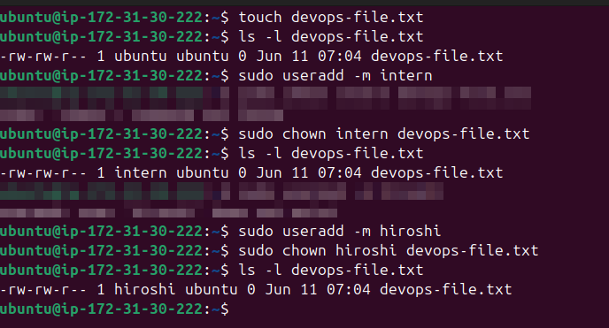
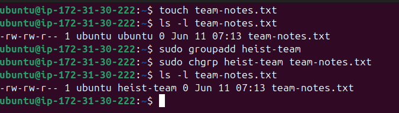
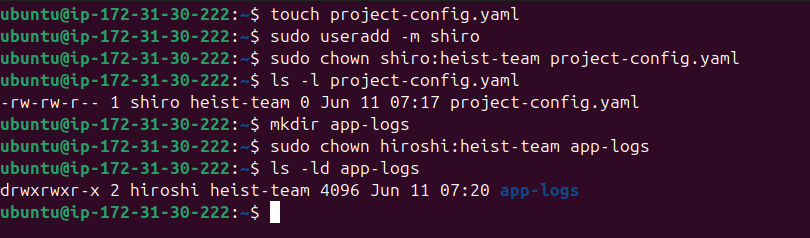
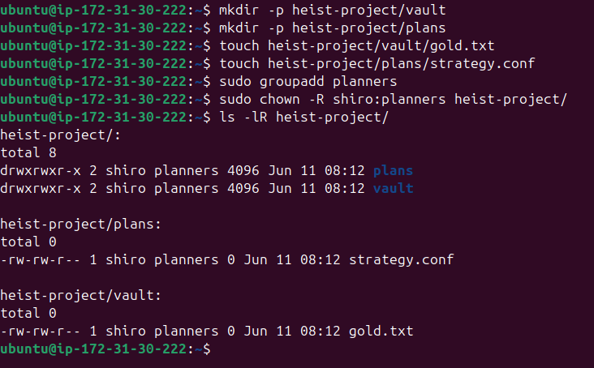
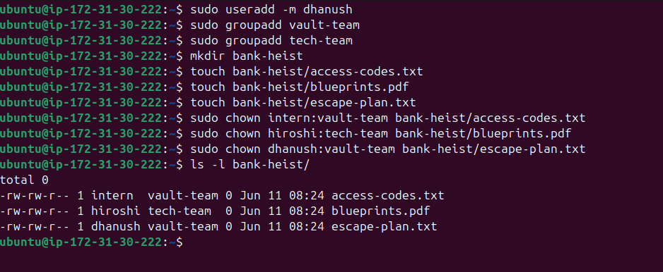

Challenge Goal: Master file and directory ownership in Linux - understand user/group ownership, use chown and chgrp, and apply recursive changes.

------------

## � Key Concepts

### What is File Ownership?

In Linux, every file and directory has **two ownership attributes**:

| Attribute | Description |
|-----------|-------------|
| **Owner (User)** | The individual user who owns the file. Has the most control - can read, write, delete, and change permissions. |
| **Group** | A collection of users who share a common level of access. Useful for teams working on the same project. |

### Owner vs Group - What's the Difference?

```
-rw-r--r-- 1 nehal nehal 0 Jun 11 10:25 notes.txt
             ^^^^^ ^^^^^
             owner group
```

- **Owner:** The person who created or was assigned ownership. Has individual-level control.
- **Group:** Lets multiple users share access without giving everyone full ownership. For example, a `dev-team` group can read/write shared project files while others can only read.

> **Real-world analogy:** Think of the owner as the author of a document, and the group as a department that has access to it in a shared drive.

---
## ✅ Task 1: Understanding Ownership

### Commands Run

```bash
ls -l ~
```

### Expected Output



### Output Breakdown

```
-rw-rw-r--   1   ubuntu   ubuntu   39   Jun 10 06:31  notes.txt
│            │   │        │
│            │   │        └── Group owner
│            │   └─────────── User owner
│            └─────────────── Hard link count
└──────────────────────────── Permissions (file type + rwx for owner/group/others)
```

### Key Takeaway

- **User/Owner** is who controls the file individually.
- **Group** is the team-level access layer.
- Permissions for each are set separately using `chmod`; ownership is set using `chown` and `chgrp`.

---

## ✅ Task 2: Basic chown Operations

### Commands Run

```bash
# Step 1: Create the file
touch devops-file.txt

# Step 2: Check current owner
ls -l devops-file.txt

# Step 3: Create user intern
sudo useradd -m intern

# Step 4: Change owner(user) to intern
sudo chown intern devops-file.txt
ls -l devops-file.txt


# Step 5: Create user hiroshi and change owner
sudo useradd -m hiroshi
sudo chown hiroshi devops-file.txt
ls -l devops-file.txt
```

### Expected Output



### Ownership Change Log

| Step                  | Owner   | Group  |
| --------------------- | ------- | ------ |
| Initial               | ubuntu  | ubuntu |
| After `chown intern`  | intern  | ubuntu |
| After `chown hiroshi` | hiroshi | ubuntu |

> � **Note:** `chown` with just a username only changes the **owner**, not the group.

---

## ✅ Task 3: Basic chgrp Operations

### Commands Run

```bash
# Step 1: Create the file
touch team-notes.txt

# Step 2: Check current group
ls -l team-notes.txt

# Step 3: Create group
sudo groupadd heist-team

# Step 4: Change group to heist-team
sudo chgrp heist-team team-notes.txt

# Step 5: Verify
ls -l team-notes.txt
```

### Expected Output



### Ownership Change Log

| Step | Owner | Group |
|------|-------|-------|
| Initial | ubuntu | ubuntu |
| After `chgrp heist-team` | ubuntu | heist-team |

> � **Note:** `chgrp` only changes the **group**, leaving the owner untouched.

---

## ✅ Task 4: Combined Owner & Group Change

### Commands Run

```bash
# Step 1: Create file
touch project-config.yaml

# Step 2: Create user shiro (if not exists)
sudo useradd -m shiro

# Step 3: Change both owner AND group in one command
sudo chown shiro:heist-team project-config.yaml
ls -l project-config.yaml

# Step 4: Create directory
mkdir app-logs

# Step 5: Change ownership of directory
sudo chown hiroshi:heist-team app-logs
ls -ld app-logs

```

### Expected Output



### Ownership Change Log

| File/Dir                      | Owner   | Group      |
| ----------------------------- | ------- | ---------- |
| project-config.yaml (initial) | ubuntu  | ubuntu     |
| project-config.yaml (after)   | shiro   | heist-team |
| app-logs/ (initial)           | ubuntu  | ubuntu     |
| app-logs/ (after)             | hiroshi | heist-team |

> � **Syntax tip:** `sudo chown owner:group filename` - >the colon `:` separates user and group. You can also use `chown :groupname file` to change only the group via chown.

---

## ✅ Task 5: Recursive Ownership

### Commands Run

```bash
# Step 1: Create directory structure
mkdir -p heist-project/vault
mkdir -p heist-project/plans
touch heist-project/vault/gold.txt
touch heist-project/plans/strategy.conf

# Step 2: Create group planners
sudo groupadd planners

# Step 3: Apply recursive ownership change
sudo chown -R yakshitha:planners heist-project/

# Step 4: Verify all files/subdirs changed
ls -lR heist-project/
```

### Expected Output of `ls -lR heist-project/`



### Ownership Change Log

| Path                              | Before        | After          |
| --------------------------------- | ------------- | -------------- |
| heist-project/                    | ubuntu:ubuntu | shiro:planners |
| heist-project/vault/              | ubuntu:ubuntu | shiro:planners |
| heist-project/plans/              | ubuntu:ubuntu | shiro:planners |
| heist-project/vault/gold.txt      | ubuntu:ubuntu | shiro:planners |
| heist-project/plans/strategy.conf | ubuntu:ubuntu | shiro:planners |

> � **The `-R` flag** applies ownership changes **recursively** - to the directory itself, all subdirectories, and all files within. Without `-R`, only the top-level directory ownership changes.

---

## ✅ Task 6: Practice Challenge

### Setup - Users, Groups & Files

```bash
# Create users (skip if already exist)
sudo useradd -m intern
sudo useradd -m rishima
sudo useradd -m dhanush

# Create groups
sudo groupadd vault-team
sudo groupadd tech-team

# Create directory and files
mkdir bank-heist
touch bank-heist/access-codes.txt
touch bank-heist/blueprints.pdf
touch bank-heist/escape-plan.txt
```

### Assign Ownership

```bash
# access-codes.txt → intern:vault-team
sudo chown intern:vault-team bank-heist/access-codes.txt

# blueprints.pdf → rishima:tech-team
sudo chown rishima:tech-team bank-heist/blueprints.pdf

# escape-plan.txt → dhanush:vault-team
sudo chown dhanush:vault-team bank-heist/escape-plan.txt
```

### Verify

```bash
ls -l bank-heist/
```

### Expected Output



### Ownership Summary

| File             | Owner   | Group      |
| ---------------- | ------- | ---------- |
| access-codes.txt | intern  | vault-team |
| blueprints.pdf   | hiroshi | tech-team  |
| escape-plan.txt  | dhanush | vault-team |

---
## �️ Commands Used - Full Reference

```bash
# View file ownership
ls -l filename
ls -ld directoryname        # View directory itself (not its contents)
ls -lR directoryname        # View directory contents recursively

# User & Group management
sudo useradd -m username    # Create a new user with home directory
sudo groupadd groupname     # Create a new group

# Change owner only
sudo chown newowner filename

# Change group only
sudo chgrp newgroup filename
sudo chown :newgroup filename   # Also works with chown

# Change both owner and group (one command)
sudo chown owner:group filename

# Recursive change (applies to dir + all contents)
sudo chown -R owner:group directory/
```

---

## � What I Learned

**1. Every file has two ownership layers - user and group.**
Linux uses a dual-ownership model. The user owner has personal control, and the group owner allows shared team access. This separation is what makes multi-user environments safe and collaborative.

**2. `chown` is more powerful than `chgrp`.**
While `chgrp` only changes the group, `chown` can change the owner, the group, or both at once using the `owner:group` syntax. In practice, most DevOps engineers just use `chown` for everything.

**3. The `-R` flag is essential for directory ownership in real deployments.**
When deploying apps or setting up shared directories, you need all files inside a directory to be owned correctly - not just the top-level folder. Forgetting `-R` is a very common mistake that causes permission errors in apps and pipelines.

---

## � Why This Matters for DevOps

| Scenario | Why Ownership Matters |
|----------|----------------------|
| **Application Deployments** | Web servers like nginx run as `www-data` - app files must be owned by that user/group to be readable. |
| **Shared Team Directories** | Group ownership lets multiple developers write to a shared `/var/project` without opening it to everyone. |
| **Container Permissions** | Docker containers run processes as specific UIDs - mismatched ownership causes "Permission denied" errors in mounts. |
| **CI/CD Artifacts** | Pipeline build artifacts and logs need to be readable by the CI runner user/group. |
| **Log File Management** | Log rotation services (like `logrotate`) need correct ownership to create and rotate log files. |

---

## � Troubleshooting

| Error | Cause | Fix |
|-------|-------|-----|
| `chown: invalid user: 'intern'` | User doesn't exist yet | `sudo useradd -m intern` first |
| `chgrp: invalid group: 'vault-team'` | Group doesn't exist yet | `sudo groupadd vault-team` first |
| `Operation not permitted` | Running without sudo | Prefix command with `sudo` |
| Only top-level dir changed | Forgot `-R` flag | Use `sudo chown -R owner:group dir/` |

---
