1.Ran **df -h** to confirm no additional volumes were attached yet.

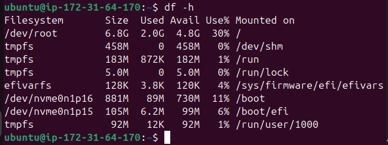

2.Created a new EBS volume in AWS, ensuring the availability zone matched our EC2 instance (e.g., us-east-1f).
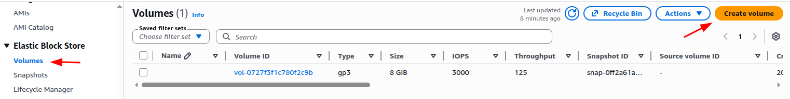

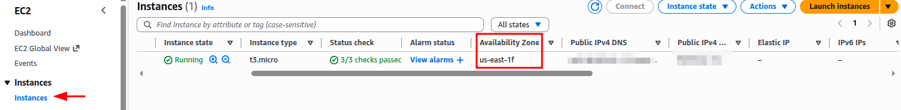

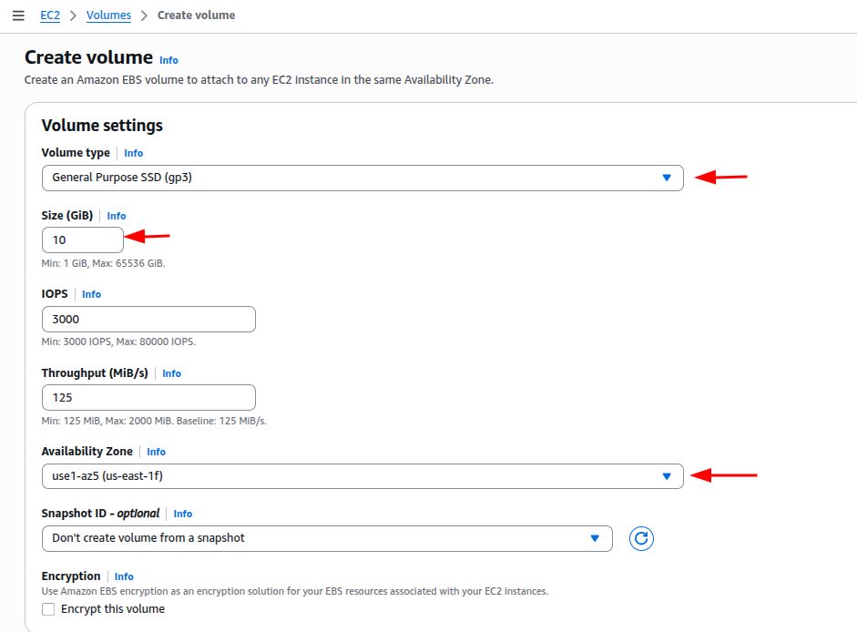
3.Attached the volume to your EC2 instance and verified it with **lsblk**.
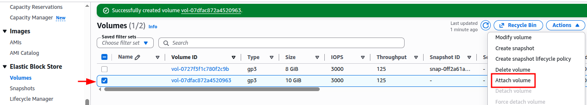

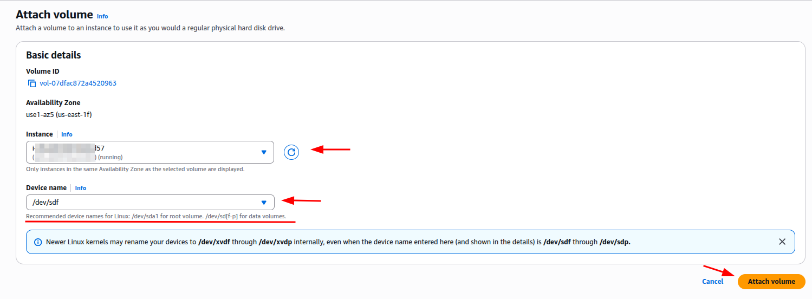

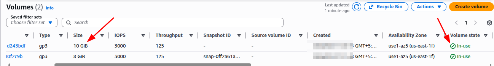

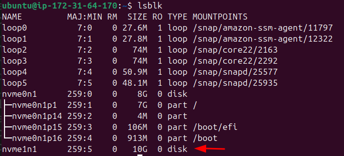

4.Created a mount directory (e.g., /mnt/data).

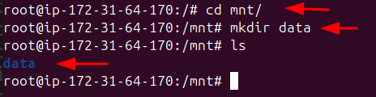

5.Formatted the new volume with **mkfs -t ext4**

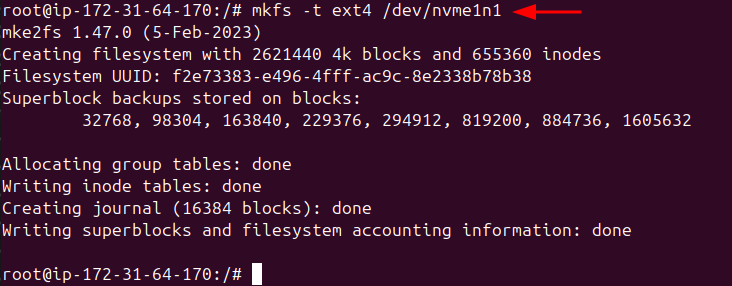

6.Mounted the volume and added its UUID to /etc/fstab for permanent mount means after vm reboot this volume will not detach
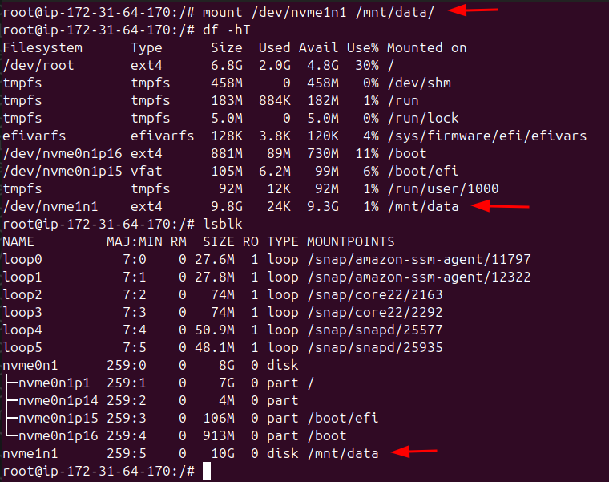

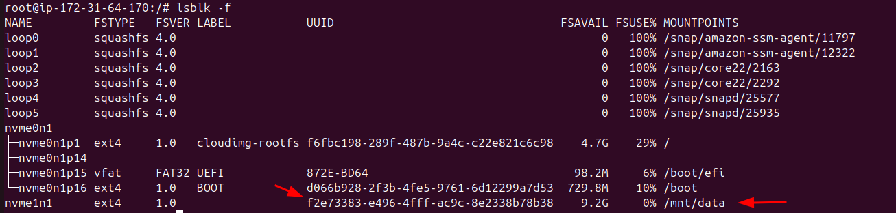

root@ip-172-31-64-170:/# vim /etc/fstab

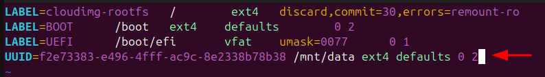

root@ip-172-31-64-170:/# mount -a

Above one is traditional way

Now below one is modern way (real env Devops)

Logical Volume Manager(LVM)

7.Initialized the disk as a physical volume with pvcreate, created a volume group with vgcreate, and added logical volumes using lvcreate.

Disk(s) -> Physical volume (pv) -> Volume group (vg) -> Logical volume (lv) -> Filesystem (ext4/xfs) 
-> Mount Point(/data)

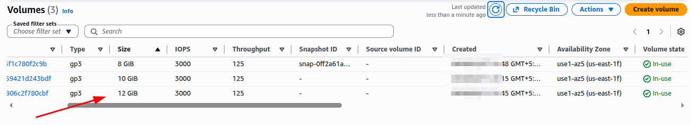

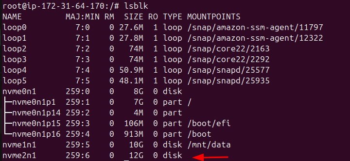

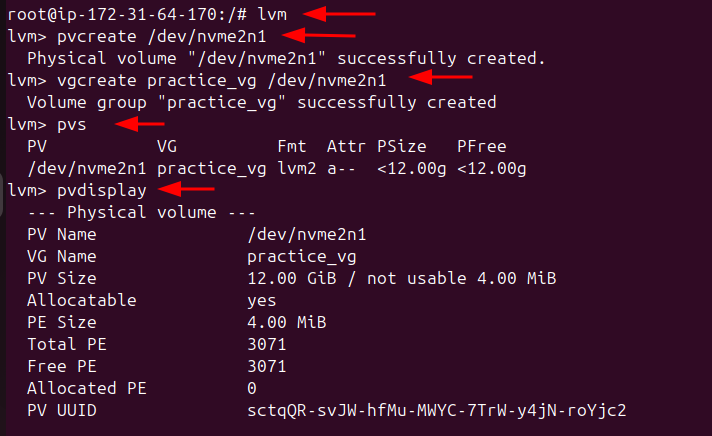

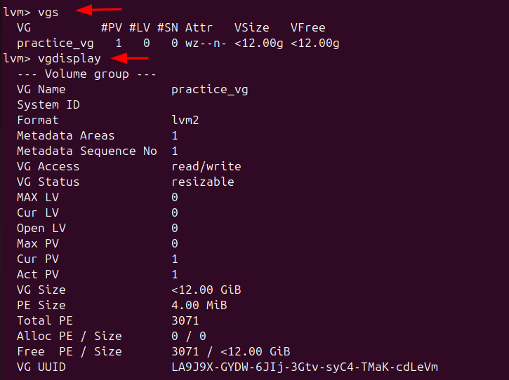

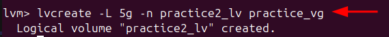

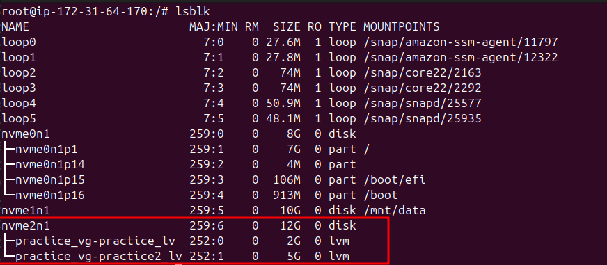

8.Formatted the logical volumes and mounted them to specific directories.

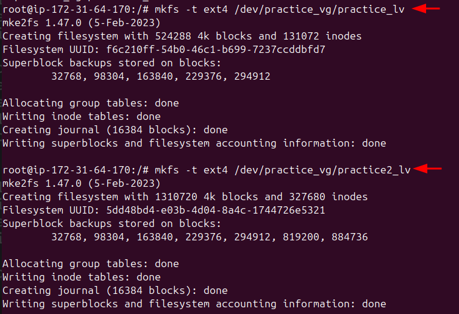

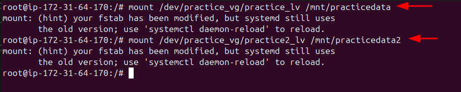

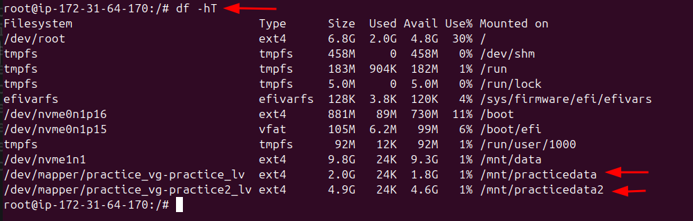

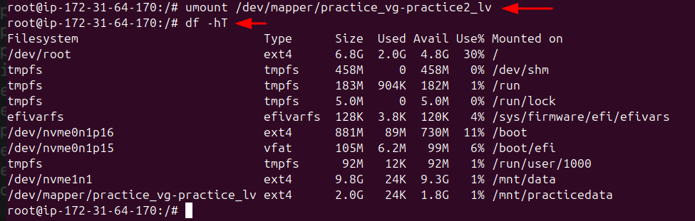

9.Extended a logical volume with lvextend and resized the filesystem with **resize2fs**

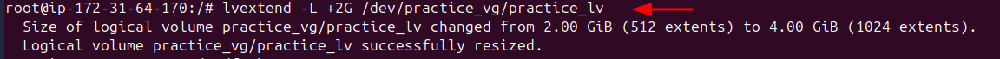

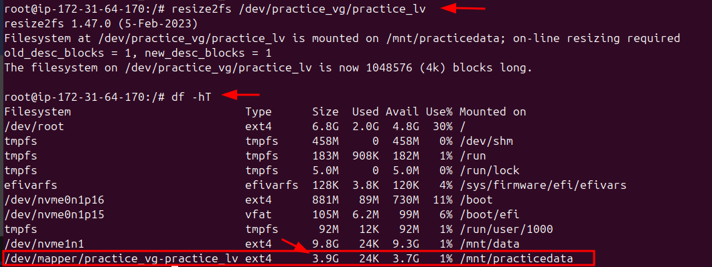

10.To safely remove LVM,  unmounted, removed the logical volumes, volume group, and physical volume, and wiped the disk clean.

**LVM Reverse Process (Delete Everything Safely)**

Unmount → Remove LV → Remove VG → Remove PV

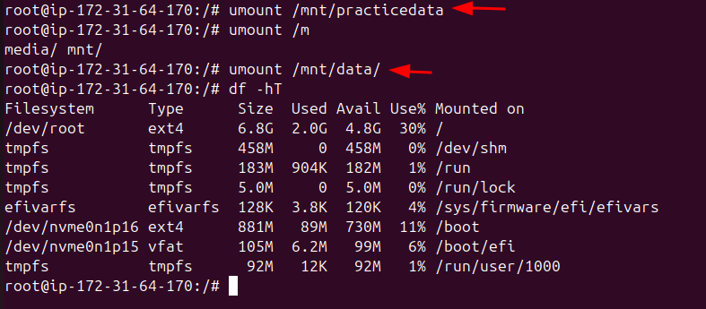

Remove entry from **`/etc/fstab`** (VERY IMPORTANT)

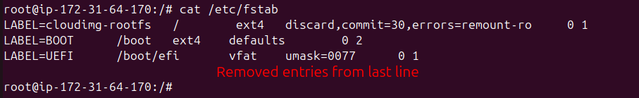

**mount -a**
(No errors should appear.)

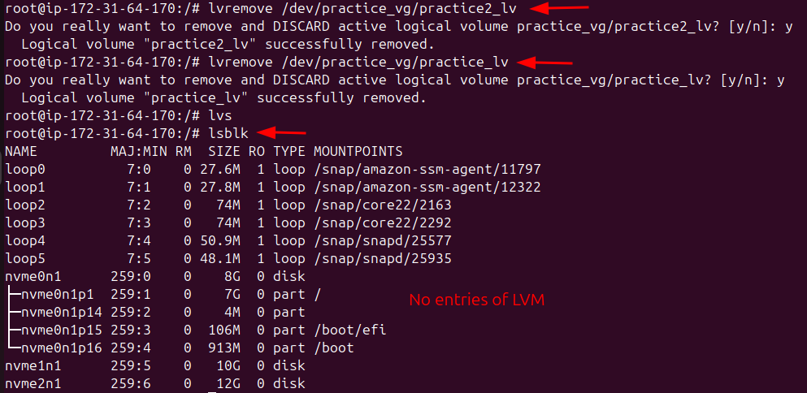

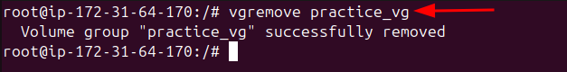

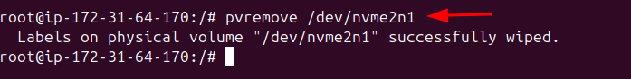

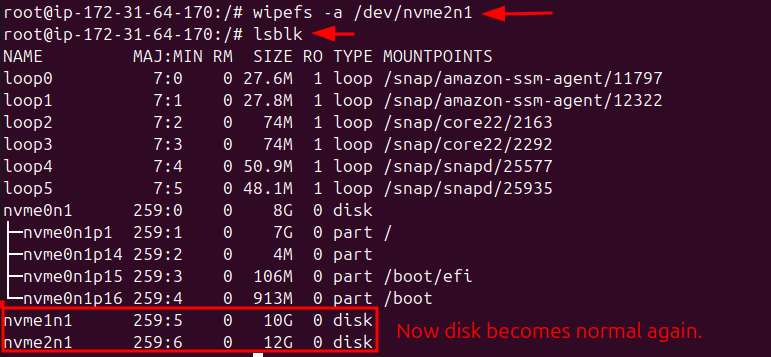

---
