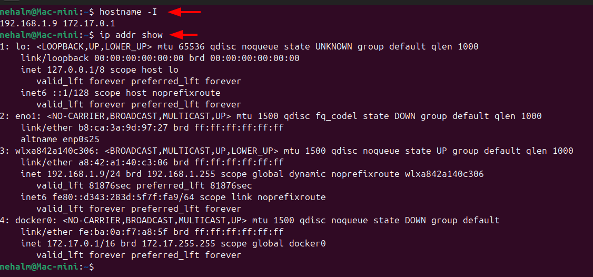
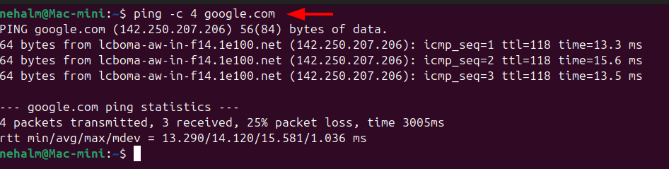
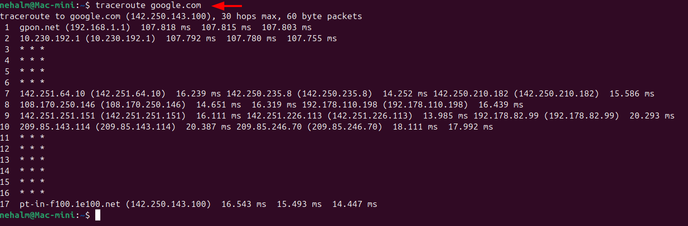
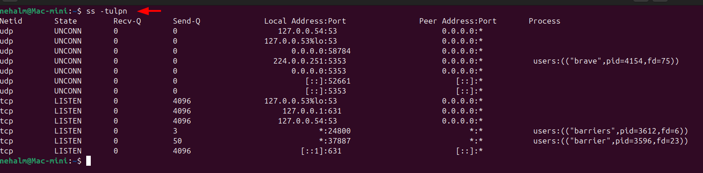
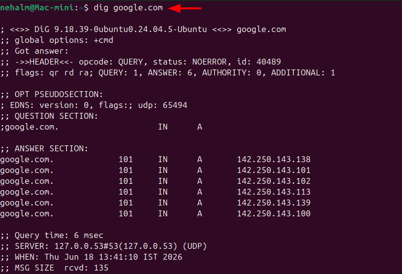
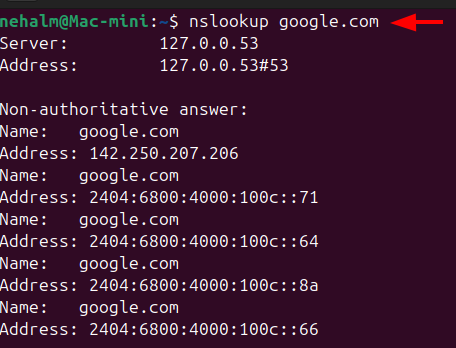
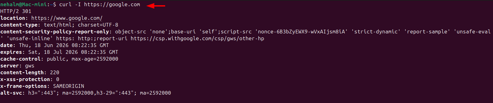
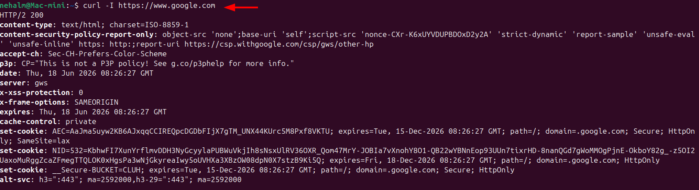
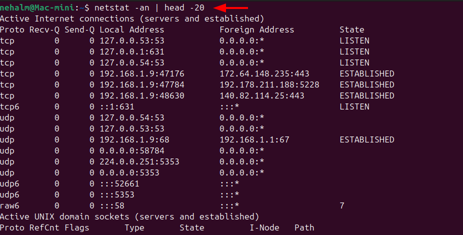

## � Quick Concepts

### OSI Model (L1-L7) vs TCP/IP Stack

| OSI Layer | OSI Layer Name | TCP/IP Layer   | Examples                                                  |
| --------- | -------------- | -------------- | --------------------------------------------------------- |
| L7        | Application    | Application    | HTTP, HTTPS, DNS, SSH, FTP                                |
| L6        | Presentation   | Application    | SSL/TLS, encoding, compression, encryption/decryption     |
| L5        | Session        | Application    | Session management                                        |
| L4        | Transport      | Transport      | TCP, UDP (ports live here)                                |
| L3        | Network        | Internet       | IP, ICMP, routing                                         |
| L2        | Data Link      | Network Access | Ethernet, MAC addresses, ARP(Address Resolution Protocol) |
| L1        | Physical       | Network Access | Cables, NICs, Wi-Fi signals                               |

- **OSI** is the theoretical 7-layer model used to *reason about* where things break. Each layer has a clear responsibility.
- **TCP/IP** is the practical 4-layer model the internet actually runs on - it collapses the top 3 OSI layers into one "Application" layer.
- **ARP** converts IP address → MAC address, also IP is logical, MAC is physical - ARP bridges the two

---

### Where Protocols Sit in the Stack

| Protocol | Layer (OSI)      | Layer (TCP/IP) | Purpose                                                                                  |
| -------- | ---------------- | -------------- | ---------------------------------------------------------------------------------------- |
| IP       | L3 - Network     | Internet       | Addressing & routing packets across networks                                             |
| TCP      | L4 - Transport   | Transport      | Reliable, ordered delivery (connection-oriented)                                         |
| UDP      | L4 - Transport   | Transport      | Fast, connectionless delivery (no guarantees)                                            |
| DNS      | L7 - Application | Application    | Resolves domain names → IP addresses                                                     |
| HTTP     | L7 - Application | Application    | Web traffic (plain text)                                                                 |
| HTTPS    | L7 - Application | Application    | HTTPS - L7 (Application) encrypted over TLS (L6 (Encryption) / L5 (Session) in OSI terms) |

---

### Real-World Example

```
curl https://example.com
```

Breaking it down layer by layer:

```
Application Layer  →  curl sends an HTTP GET request
                       DNS resolves "example.com" → 93.184.216.34
Transport Layer    →  TCP 3-way handshake on port 443
                       TLS handshake for HTTPS encryption
Internet Layer     →  IP packets routed from your machine to 93.184.216.34
Link Layer         →  Ethernet/Wi-Fi frames carry packets on local network
```

> One command = 4 layers working together, every single time you hit a URL.

---

## �️ Hands-on Checklist & Command Outputs

> **Target host for all checks:** `google.com`

---

### 1. Identity - Your IP Address



**Observation:**
- `hostname -I` gives a quick flat list of all IPs assigned to the machine.
- `ip addr show` shows the full interface info including subnet mask (`/24` = 256 IPs) and broadcast address.
- System has multiple network interfaces. Each active interface can have its own IP address. In my case, one IP belongs to the local network (192.168.1.9) and another belongs to the Docker bridge network (172.17.0.1).

---

### 2. Reachability - Ping



The first line shows the target hostname, the resolved IP address, and the packet size being sent. It also confirms that DNS resolution is working because the hostname was successfully converted into an IP address.

**Observation:**
- google.com successfully resolved to 142.250.207.206
- DNS is working correctly
- ICMP packets are being sent to Google's server
- 25% packet loss was observed during the test
- Average latency is around 14 ms, which is very good

---

### 3. Path - Traceroute



Traceroute shows the path packets take from the source to the destination through multiple routers (hops). In my output, the traffic passed through the local router, ISP network, and Google backbone before reaching Google in 17 hops with an average latency of around 15 ms.

### Observation

👉 **"The network path to Google was successfully traced through 17 hops, DNS resolution worked correctly, and the destination was reached with low latency (~15 ms)."**

---

### 4. Ports - Listening Services



The system has multiple listening services. Local DNS is running on port 53, printing services are listening on port 631, and the Barrier application is listening on ports 24800 and 37887. The Brave browser is also using UDP port 5353 for mDNS service discovery.

# Quick Summary Table

| Port  | Service  | Observation             |
| ----- | -------- | ----------------------- |
| 53    | DNS      | Local DNS resolver      |
| 631   | CUPS/IPP | Printing service        |
| 5353  | mDNS     | Brave browser discovery |
| 24800 | Barrier  | Keyboard/mouse sharing  |
| 37887 | Barrier  | Barrier service         |
`ss -tulpn` is used to identify listening TCP/UDP ports and the processes associated with them. From my output, I observed DNS services on port 53, printing services on port 631, and Barrier application services listening on ports 24800 and 37887.

---

### 5. Name Resolution - DNS Check



> **I used `dig google.com` to perform a DNS lookup. The query completed successfully with `NOERROR`, returning six A records for Google, which indicates DNS resolution is working correctly. The response was received in 6 ms through the local DNS resolver (127.0.0.53).**

### Quick Observation

👉 **DNS is healthy.**  
👉 **google.com resolved to multiple IP addresses for load balancing.**  
👉 **DNS response time was very fast (6 ms).** 🚀

```
# Or quick shorthand:
dig +short google.com
# Output:
142.250.143.138
142.250.143.100
142.250.143.101
142.250.143.139
142.250.143.113
142.250.143.102

```




> **I used `nslookup google.com` to verify DNS resolution. The query was successful and returned both IPv4 and IPv6 addresses for Google, confirming that the DNS resolver (127.0.0.53) is working correctly.**

### One-Line Observation

👉 **DNS resolution is healthy, and the system can successfully resolve `google.com` to both IPv4 and IPv6 addresses.**


---

### 6. HTTP Check - Status Code



> **I used `curl -I https://google.com` to fetch only the HTTP response headers. The server returned `HTTP/2 301 Moved Permanently`, redirecting traffic to `https://www.google.com/`. The response also confirmed that HTTPS connectivity, server reachability, and security headers were working correctly.**

### One-Line Observation

👉 **Google is reachable over HTTPS and responds with a 301 redirect to `www.google.com`, indicating normal web server behavior.**

---



> **I used `curl -I https://www.google.com` to inspect the HTTP response headers. The server returned `HTTP/2 200 OK`, confirming successful HTTPS connectivity and web server availability. The response also included security headers, cookies, and HTTP/3 support information.**

### One-Line Observation

👉 **The Google web server is reachable, responding with HTTP 200 OK, and serving content successfully over HTTPS.**

---

### 7. Connections Snapshot




> **I used `netstat -an` to view active network connections and listening ports. The output showed local DNS services listening on port 53, printing services on port 631, active HTTPS connections on port 443, and DHCP communication with the router. This confirmed that networking services were functioning normally.**

### One-Line Observation

👉 **The system has active DNS, DHCP, HTTPS, and mDNS communication, with several services listening locally and multiple established network connections.**

---

## � Mini Task: Port Probe & Interpret

### Step 1: Identified Listening Port

From `ss -tulpn` output above → **SSH on port 22** (`sshd`, listening on `0.0.0.0:22`)

### Step 2: Test Connectivity to the Port

```bash
nc -zv localhost 22
# Output:
# Connection to localhost (127.0.0.1) 22 port [tcp/ssh] succeeded!
```

Or via curl:

```bash
curl -v telnet://localhost:22
# Output:
* Host localhost:22 was resolved.
* IPv6: ::1
* IPv4: 127.0.0.1
*   Trying [::1]:22...
* Established connection to localhost (::1 port 22) from ::1 port 34912 
SSH-2.0-OpenSSH_10.2p1 Ubuntu-2ubuntu3.2
```

### Step 3: Interpretation

**Result: Port 22 is reachable. SSH service is up and responding with its banner (`SSH-2.0-OpenSSH_20.2p1`).**

If it were *not* reachable, the next checks would be:
1. **Is the service running?** → `systemctl status sshd`
2. **Is a firewall blocking it?** → `sudo ufw status` or `sudo iptables -L -n | grep 22`
3. **Is something else occupying that port?** → `sudo ss -tulpn | grep :22`

---

## � Reflection

### Which command gives the fastest signal when something is broken?

**`ping`** is my first reflex - it gives an immediate binary answer: is the host alive on the network or not? Zero output or 100% packet loss = network/routing problem. From there:
- If `ping` passes but the app fails → move up to L7 (`curl -I`)
- If `ping` fails but the host is supposedly up → check routing/DNS (`traceroute`, `dig`)

The **"ping → curl" combo** gives you a full L3-to-L7 health check in two commands.

---

### What layer would you inspect if...

**DNS fails?**
→ Start at the **Application layer** (is the DNS config correct? `/etc/resolv.conf`), then drop to **Internet/Transport** (can I reach the DNS server IP at all? `ping 8.8.8.8`). DNS failure is usually misconfigured resolver or a UDP port 53 being blocked by a firewall.

**HTTP 500 appears?**
→ This is purely an **Application layer** issue. The network is fine - the server received your request but crashed processing it. Check:
- Application/web server logs (`journalctl -u nginx`, `tail -f /var/log/app/error.log`)
- Service health (`systemctl status <service>`)
- Recent code deployments or config changes

---

### Two follow-up checks in a real incident

1. **`journalctl -u <service-name> --since "10 minutes ago"`**
   Pulls recent logs for the failing service. Most production incidents leave a clear error trail in logs - "connection refused", "OOM killed", "permission denied".

2. **`ss -tulpn` + `curl -I http://localhost:<port>`**
   Verifies the service is actually listening on its expected port, and that it responds locally. If it works on localhost but not externally, the problem is firewall rules or network routing - not the app itself.

---

## � Command Quick Reference

| Command | What it checks | OSI Layer |
|---------|---------------|-----------|
| `ping` | Host reachability via ICMP | L3 - Network |
| `traceroute` | Hop-by-hop path to host | L3 - Network |
| `dig` / `nslookup` | DNS resolution | L7 - Application |
| `ss -tulpn` | Listening ports & processes | L4 - Transport |
| `curl -I <url>` | HTTP response code | L7 - Application |
| `nc -zv <host> <port>` | TCP port reachability | L4 - Transport |
| `netstat -an` | Active connections snapshot | L4 - Transport |
| `ip addr show` | Local IP configuration | L3 - Network |

---

Practiced the core networking toolkit today - `ping`, `traceroute`, `dig`, `ss`, `curl -I`, and `nc`. 
Found that `traceroute google.com` took 19 hops but latency stayed flat at ~2ms throughout - traffic jumped straight onto Google's own network by hop 4 (`192.178.x.x`). 
Running `curl -I https://google.com` returned a 301 redirect to `www.google.com` which then hit 200 - a reminder that even simple URLs have redirect chains hidden from the browser. 
Also spotted 2 `TIME_WAIT` connections to `169.254.169.254` in `netstat` - the AWS EC2 metadata endpoint quietly running in the background.

---
