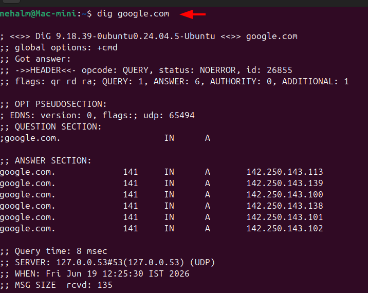

## Task 1: DNS (Domain Name System) – How Names Become IPs

### What is DNS?

**DNS stands for Domain Name System.**

Humans remember names. Computers understand numbers. DNS is the translator between the two.

When you type `youtube.com`, your computer has no idea where that is. DNS converts that name into an IP address like `142.251.43.142` - which is the actual address your browser uses to connect to YouTube's server.

> Think of DNS like a phonebook. You look up "Pizza Hut" (domain name) and get their phone number (IP address). You don't memorize the number - you just look up the name.

---

### What happens when you type `google.com` in a browser?

Here's the full journey, step by step:

1. You type `google.com` and hit Enter
2. Your browser checks its **local cache** - *"have I visited this recently? do I already know the IP?"*
3. If not, it asks your **OS (Operating System)**
4. OS checks its own cache, then asks a **DNS Resolver** (usually your ISP's server or Google's 8.8.8.8)
5. The resolver doesn't know the answer directly - it goes on a hunt:
   - Asks a **Root Server** → *"who handles .com domains?"*
   - Root server says → *"ask the TLD (Top Level Domain) server"*
   - TLD server says → *"ask Google's authoritative nameserver"*
   - Authoritative nameserver says → *"google.com = 142.250.183.78"*
6. Resolver sends that IP back to your browser
7. Browser connects to `142.250.183.78` → Google loads

All of this happens in **milliseconds**. Every. Single. Time.

---

### DNS Record Types

DNS doesn't just store IP addresses - it stores different types of records for different purposes:

| Record | Full Form | What it does | Example |
|--------|-----------|--------------|---------|
| **A** | Address Record | Maps a domain to an **IPv4** address | `google.com → 142.250.183.78` |
| **AAAA** | IPv6 Address Record | Maps a domain to an **IPv6** address | `google.com → 2607:f8b0::200e` |
| **CNAME** | Canonical Name Record | Alias - points one domain to **another domain** | `www.google.com → google.com` |
| **MX** | Mail Exchange Record | Tells email where to go | `gmail.com → mail server` |
| **NS** | Nameserver Record | Says which DNS server is authoritative (authoritative nameserver = the final boss who actually knows the real IP, real records, everything about that domain) for this domain | `google.com → ns1.google.com` |

---

### `dig google.com` - Command Output

`dig` stands for **Domain Information Groper** - it's a command to manually query DNS.




Breaking this down:
- **`google.com.`** → the domain we queried
- **`141`** → TTL (Time To Live) in seconds - this answer is cached for 141 seconds, after which your computer re-asks DNS
- **`IN`** → Internet class (always IN for normal DNS)
- **`A`** → record type (IPv4 address)
- Google doesn't run on one server - they have thousands of servers worldwide; so google.com has multiple IPs - all pointing to different Google servers.

> **TTL = expiry timer.** Like milk with an expiry date - after TTL expires, your computer throws away the cached answer and fetches a fresh one.

---

## Task 2: IP Addressing

### What is an IPv4 Address?

**IPv4 stands for Internet Protocol version 4.**

Every device on a network gets an IP address - it's like a home address for your computer. Without it, data wouldn't know where to go.

An IPv4 address is a **32-bit number** written as 4 groups of numbers separated by dots:

```
192  .  168  .  1  .  10
 ↑        ↑      ↑    ↑
 8bits   8bits  8bits  8bits  =  32 bits total
```

Each group (called an **octet**) can be between **0 and 255**.

So `192.168.1.10` is a perfectly valid IPv4 address.

---

### Public IP vs Private IP

- Public IP: ISP assigns it dynamically. every time your router restarts, or sometimes daily - new public IP. that's why it's called **dynamic IP**.
- Private IP: router assigns it via DHCP (Dynamic Host Configuration Protocol)
 
```
  Both can change frequently, but we can make it permanent by setting static public/private IP.
```
  
| Type | What it is | Example | Who assigns it |
|------|-----------|---------|----------------|
| **Public IP / dynamic IP** | Visible on the internet, globally unique | `8.8.8.8` | Your ISP (Jio, Airtel etc.) |
| **Private IP** | Only exists inside your local network, invisible to internet | `192.168.1.23` | Your router |

**Real life example:**

Your apartment building has **one street address** (public IP) - that's what the outside world sees.

Inside the building, each flat has a **flat number** (private IP) - 101, 102, 103. These flat numbers mean nothing to someone outside the building.

When you get a letter (internet traffic), it comes to the building's address (public IP), and your router (the security guard) forwards it to the right flat (private IP).

---

### Private IP Ranges

These ranges are **reserved** - no ISP will ever route them on the public internet. They're safe to use inside any private network without conflict.

```
10.0.0.0  –  10.255.255.255     →  ~16 million IPs  →  Large companies, AWS VPCs, data centers
172.16.0.0 – 172.31.255.255     →  ~1 million IPs   →  Medium-sized networks
192.168.0.0 – 192.168.255.255   →  ~65,000 IPs      →  Home routers, small offices
```

> **Why these specific ranges?** IANA (Internet Assigned Numbers Authority) simply reserved them decades ago and declared: *"these will never go on the public internet."* Everyone agreed. Now it's a global standard. Your `192.168.1.1` at home and my `192.168.1.1` at my home are completely separate - they never collide because they never leave their own networks.

---

### `ip addr show` - Command Output

```bash
$ ip addr show

1: lo: <LOOPBACK,UP,LOWER_UP> mtu 65536 qdisc noqueue state UNKNOWN group default qlen 1000
    link/loopback 00:00:00:00:00:00 brd 00:00:00:00:00:00
    inet 127.0.0.1/8 scope host lo
       valid_lft forever preferred_lft forever
    inet6 ::1/128 scope host noprefixroute 
       valid_lft forever preferred_lft forever
2: enX0: <BROADCAST,MULTICAST,UP,LOWER_UP> mtu 9001 qdisc fq_codel state UP group default qlen 1000
    link/ether 0a:ff:fb:22:25:dd brd ff:ff:ff:ff:ff:ff
    altname enx0afffb2225dd
    inet 172.31.45.12/20 metric 100 brd 172.31.31.255 scope global dynamic enX0
       valid_lft 3251sec preferred_lft 3251sec
    inet6 fe80::8ff:fbff:fe22:25dd/64 scope link proto kernel_ll 
       valid_lft forever preferred_lft forever
```

- `172.31.45.12` → falls in `172.16.x.x – 172.31.x.x` range → **private IP** (AWS EC2 internal address)
- `127.0.0.1` → **loopback address** (localhost) - your machine talking to itself, not routable anywhere

---

## Task 3: CIDR (Classless Inter-Domain Routing) & Subnetting

### What is CIDR?

**CIDR stands for Classless Inter-Domain Routing.**

It's a compact way to write an IP address + its network size together.

Example: `192.168.1.0/24`

The `/24` part is called the **prefix length** - it tells you how many bits are reserved for the **network**, and how many are left for **hosts (devices)**.

---

### What does `/24` mean in `192.168.1.0/24`?

An IP address has 32 bits total.

`/24` means → first **24 bits = network**, remaining **8 bits = hosts**

```
192.168.1  .  0
←  24 bits  → ← 8 bits →
  (network)    (hosts)
```

Subnet mask equivalent: `255.255.255.0`

So `192.168.1.0/24` covers addresses from `192.168.1.0` to `192.168.1.255` - that's 256 addresses in one network.

---

### Usable Hosts Calculation

In every subnet, 2 addresses are always reserved:
- **First address** → Network address / CIDR base IP (identifies the subnet itself)
- **Last address** → Broadcast address / Boroadcast IP (sends data to all devices in subnet)

So usable = Total − 2

| CIDR | Total IPs | Minus 2 | Usable Hosts |
|------|-----------|---------|--------------|
| /24  | 256       | −2      | **254**      |
| /16  | 65,536    | −2      | **65,534**   |
| /28  | 16        | −2      | **14**       |

---

### Why do we subnet?

Imagine a school with 1000 students all sharing one giant classroom. Chaos. Nobody can hear anyone. One person sneezes and everyone knows.

Subnetting is like dividing that school into **separate classrooms** - each with its own group, its own rules, its own door.

Benefits:
- **Security** - a breach in one subnet doesn't automatically spread to others
- **Performance** - less broadcast traffic (devices stop shouting to the entire network)
- **Organization** - HR team on one subnet, Engineering on another, Database servers on another
- **Control** - apply different firewall rules per subnet

> On AWS, this is exactly why you have **public subnets** (for web servers) and **private subnets** (for databases) inside a VPC.

---

### CIDR Quick Reference Table

| CIDR | Subnet Mask | Total IPs | Usable Hosts |
|------|-------------|-----------|--------------|
| /24  | 255.255.255.0   | 256    | 254    |
| /16  | 255.255.0.0     | 65,536 | 65,534 |
| /28  | 255.255.255.240 | 16     | 14     |

---

## Task 4: Ports – The Doors to Services

### What is a Port? Why do we need them?

Your server has one IP address. But it runs multiple services at the same time - SSH, a web server, a database, maybe Redis.

How does the server know which incoming traffic goes to which service?

**Ports.**

A port is a **logical number (0–65535)** that acts like a door number on a building. The IP address gets you to the building. The port gets you to the right room.

```
IP Address  =  the building address
Port        =  the flat/room number inside
```

**Real example:**

You SSH into your EC2 server:
```bash
ssh -i key.pem ubuntu@54.23.12.10
```
Your computer connects to IP `54.23.12.10` on **port 22** - because that's where SSH lives.

At the same time, someone else hits your nginx web server at the same IP on **port 80**. Both connections land on the same machine, different port, different service. No confusion.

---

### Common Ports Every DevOps Engineer Must Know

| Port  | Service | What it does |
|-------|---------|--------------|
| 22    | SSH (Secure Shell) | Encrypted remote login to servers |
| 80    | HTTP (HyperText Transfer Protocol) | Unencrypted web traffic |
| 443   | HTTPS (HTTP Secure) | Encrypted web traffic (SSL/TLS) |
| 53    | DNS (Domain Name System) | Domain name resolution queries |
| 3306  | MySQL | Relational database communication |
| 6379  | Redis | In-memory cache / message broker |
| 27017 | MongoDB | NoSQL document database |

---

### `ss -tulpn` - Command Output

`ss` stands for **Socket Statistics** - shows all active listening ports on your machine.

Flags breakdown:
- `-t` → TCP connections
- `-u` → UDP connections
- `-l` → only listening ports
- `-p` → show process name
- `-n` → show port numbers (not service names)

```bash
$ ss -tulpn

Netid                State                 Recv-Q                Send-Q                                    Local Address:Port                               Peer Address:Port               Process                
udp                  UNCONN                0                     0                                            127.0.0.54:53                                      0.0.0.0:*                                 
udp                  UNCONN                0                     0                                         127.0.0.53%lo:53                                      0.0.0.0:*                                 
udp                  UNCONN                0                     0                                    172.31.19.100%enX0:68                                      0.0.0.0:*                                 
udp                  UNCONN                0                     0                                             127.0.0.1:323                                     0.0.0.0:*                                 
udp                  UNCONN                0                     0                                                 [::1]:323                                        [::]:*                                       
tcp                  LISTEN                0                     4096                                            0.0.0.0:22                                      0.0.0.0:*                                 
tcp                  LISTEN                0                     4096                                      127.0.0.53%lo:53                                      0.0.0.0:*                                 
tcp                  LISTEN                0                     511                                             0.0.0.0:80                                      0.0.0.0:*                                 
tcp                  LISTEN                0                     4096                                         127.0.0.54:53                                      0.0.0.0:*                                 
tcp                  LISTEN                0                     4096                                               [::]:22                                         [::]:*                                 
tcp                  LISTEN                0                     511                                                [::]:80                                         [::]:*   
```

Reading this:
- `0.0.0.0:22` → **sshd** is listening on port 22 on all interfaces → SSH is active
- `0.0.0.0:80` → **nginx** is listening on port 80 → web server is running

> If a port doesn't show here - the service is not running. First thing to check when something can't connect.

---

## Task 5: Putting It Together

### You run `curl http://myapp.com:8080` - what networking concepts are involved?

```
curl http://myapp.com:8080
```

Step by step:

1. **DNS** resolves `myapp.com` → gets an IP address
2. **IP addressing** - now the OS knows where to send the request
3. **Port 8080** - non-standard port (default HTTP is 80), so this app is running on a custom port
4. A **TCP connection** is established to that IP:port
5. The HTTP request goes through - if the server is listening on 8080, you get a response

Every single concept from today is involved in this one command.

---

### Your app can't reach a database at `10.0.1.50:3306` - what do you check first?

`10.0.1.50` is a private IP (10.x.x.x range) - so this database is inside your internal network (like AWS VPC).

Debugging order:

**Step 1 - Is the host reachable?**
```bash
ping 10.0.1.50
```
If ping fails → routing issue or firewall blocking all traffic. Database problem? Not yet your concern.

**Step 2 - Is MySQL actually running on that machine?**
```bash
ss -tulpn | grep 3306
```
If port 3306 doesn't show → MySQL is down. Start the service first.

**Step 3 - Is the port blocked between machines?**
```bash
telnet 10.0.1.50 3306
```
If this fails but ping works → firewall or AWS Security Group is blocking port 3306 specifically. Open it.

> On AWS - Security Groups are the #1 reason port-level connectivity fails. Always check inbound rules.

---

## What I Learned

1. **DNS is an automatic phonebook running silently in the background** - every domain name you type triggers a lookup chain (cache → resolver → root → TLD → authoritative), and TTL controls how long answers are remembered before re-fetching.

2. **IP addresses have intent built into their structure** - public IPs face the internet, private IPs stay internal, and CIDR notation precisely defines how many devices a network can hold. Subnetting is how you carve large networks into secure, organized segments.

3. **Ports are what make one server run many services simultaneously** - the IP gets traffic to the machine, the port gets it to the right application. Knowing which service lives on which port (22, 80, 443, 3306) is the first instinct when debugging any connectivity issue.

---
